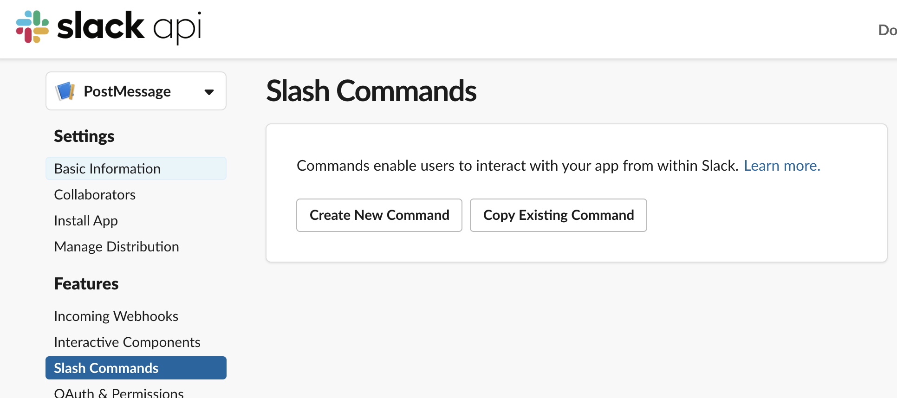
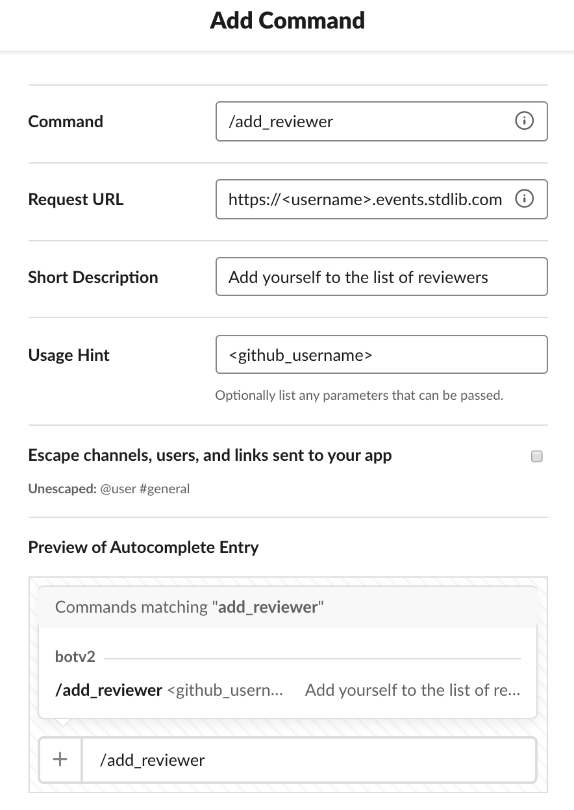
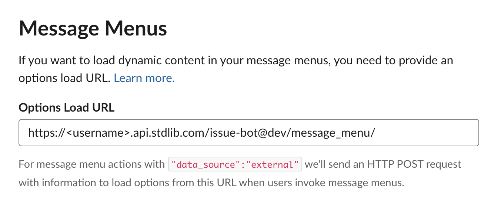

# GitHub Issues Bot

This is a Slack + GitHub + Airtable Application, written in Node.js,
on [Standard Library](https://stdlib.com), that helps you manage issues on GitHub. It sends a message to Slack when a new issue is opened on GitHub. The message will let you add/remove assignees of the issue.

## Deploying this Application

You can deploy this Slack App to [Standard Library](https://stdlib.com) by clicking this button:

You'll be asked to log in and be brought to a screen that looks something like this:

Before you can deploy the app, you need to link you Airtable, GitHub and Slack accounts.

### Airtable

Before you link your Airtable account, you need to create a base for this app. You can make one from a template
[here](https://airtable.com/addBaseFromShare/shrhwTMHWsR0CwHHq). Once you create a copy of the base. Click the **Link Resource** button. Make
sure you choose the base you just created when you are linking your account.

### GitHub

Click the **Link Resource** button. You'll be asked to install the **Build on Standard Library** application onto your account,
or an organization that you have access to.

### Slack

Click **Link Resource** and follow the instructions to build and link a Slack app.

**Note:** Once deployed, you will still need to create the `/add_user` command separately in your Slack app dashboard.
For the slash command's request URL, enter `https://<username>.events.stdlib.com/`.

### Creating your add_user Command on Slack

You can create your add_user command by visiting [api.slack.com/apps](https://api.slack.com/apps),
selecting your app, then clicking **Slash commands** on the left sidebar.

Click **Create Command** and fill out your command information. You'll want to
use `/add_reviewer` as the command name and `https://<username>.events.stdlib.com/` as the
URL, where `<username>` is your Standard Library username.

Click **Save** in the bottom right to proceed.

**Note:** For your slash command to work, your bot needs to be in the channel its called from. You can invite your bot
to a channel by typing `@<bot_name>`.

### Set your Options Load URL

Next click **Interactive Components** on the left sidebar.
Scroll down to "Message Menus" and set the "Options Load URL" to be:
`https://<username>.api.stdlib.com/issue-bot@dev/message_menu/`

Where `<username>` is your Standard Library username.

That's it, you're all done! Your Slack app should be ready to go.

# Thank You!

Please check out [Standard Library](https://stdlib.com/) or follow us on Twitter,
[@StdLibHQ](https://twitter.com/@StdLibHQ).
